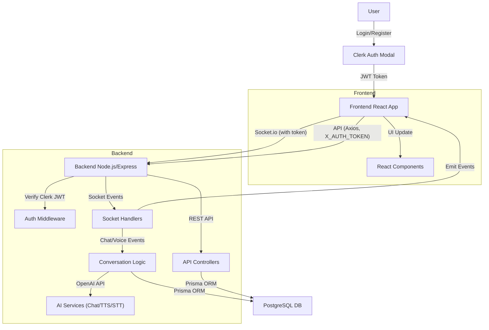

# 3AM Buddy – AI Companion App

## Project Overview

3AM Buddy is a full-stack AI-powered companion app that provides 24/7 support through real-time chat and voice calls. Users can securely log in with Clerk, chat or talk to their AI buddy, and benefit from conversation memory, summarization, and multilingual support. Built with React, Node.js, Socket.io, Prisma, and PostgreSQL.

---

## Features
- **Clerk Authentication**: Secure login/register with custom UI and Google OAuth.
- **24/7 Text Chat**: Real-time chat with AI, emoji picker, and lazy loading.
- **Voice Call with AI**: Real-time voice calls, chunked TTS streaming for fast responses.
- **Scheduled Calls**: (Coming soon) Schedule regular AI check-ins.
- **Conversation Memory**: Summarization and long-term context for personalized AI responses.
- **Multilingual Support**: Chat in English, Hindi, or Gujarati.
- **Private & Secure**: All conversations are encrypted and never shared.
- **Responsive UI**: Modern, mobile-friendly design with toast notifications.

---

## Tech Stack

**Frontend:**
- React 18
- Vite
- Clerk (Auth)
- Socket.io-client
- Axios
- Tailwind CSS
- Emoji-mart, Lucide-react

**Backend:**
- Node.js (Express)
- Socket.io
- Clerk (JWT verification, webhooks)
- Prisma ORM
- PostgreSQL
- OpenAI API (Chat, TTS, STT)
- svix (webhook signature verification)

---

## Architecture Diagram



---

## Database Schema (Prisma)

```
model User {
  id        Int      @id @default(autoincrement())
  uuid      String   @unique
  name      String?
  email     String   @unique
  username  String?  @unique
  metadata  Json?
  createdAt DateTime @default(now()) @map("created_at")
  updatedAt DateTime @updatedAt @map("updated_at")
  conversations Conversation[]
  memories      Memory[]
  @@map("users")
}

enum ConversationType {
  chat
  voice
}

enum SenderType {
  user
  ai
}

enum MessageType {
  voice
  chat
}

model Conversation {
  id           String           @id @default(uuid())
  userId       Int
  user         User             @relation(fields: [userId], references: [id])
  type         ConversationType
  startedAt    DateTime         @default(now()) @map("started_at")
  endedAt      DateTime?        @map("ended_at")
  overallMood  String?          @map("overall_user_mood")
  sentiment    String?
  metadata     Json?
  title        String?
  memoryId     String?          @unique @map("memory_id")
  memory       Memory?          @relation("ConversationMemory", fields: [memoryId], references: [id])
  messages     Message[]
  @@map("conversations")
}

model Memory {
  id             String        @id @default(uuid())
  conversation   Conversation? @relation("ConversationMemory")
  conversationId String?    @unique
  userId         Int
  user           User          @relation(fields: [userId], references: [id])
  title          String?
  summary        String?
  createdAt      DateTime      @default(now()) @map("created_at")
  metadata       Json?
  @@map("memories")
}

model Message {
  id             String         @id @default(uuid())
  conversationId String
  conversation   Conversation   @relation(fields: [conversationId], references: [id])
  sender         SenderType
  content        String
  type           MessageType
  metadata       Json?
  createdAt      DateTime       @default(now()) @map("created_at")
  @@map("messages")
}
```

---

## Setup Instructions

### Prerequisites
- Node.js (v18+ recommended)
- PostgreSQL
- Clerk account (for Auth)
- OpenAI API key

### 1. Clone the repository
```bash
git clone <your-repo-url>
cd 3ambuddy
```

### 2. Install dependencies
```bash
cd project
npm install
cd ../backend
npm install
```

### 3. Configure environment variables
- Copy `.env.example` to `.env` in both `project/` and `backend/`.
- Fill in your Clerk, OpenAI, and database credentials.

### 4. Set up the database
```bash
cd backend
npx prisma migrate deploy
npx prisma generate
```

### 5. Start the backend server
```bash
cd backend
node index.js
```

### 6. Start the frontend
```bash
cd project
npm run dev
```

---

## Environment Variables

**Frontend (`project/.env`):**
- `VITE_CLERK_PUBLISHABLE_KEY` – Clerk frontend key
- `VITE_API_BASE_URL` – Backend API URL

**Backend (`backend/.env`):**
- `DATABASE_URL` – PostgreSQL connection string
- `CLERK_SECRET_KEY` – Clerk backend key
- `OPENAI_API_KEY` – OpenAI API key
- `CLIENT_WEB_HOST` – Allowed frontend origin

---

## License

MIT
